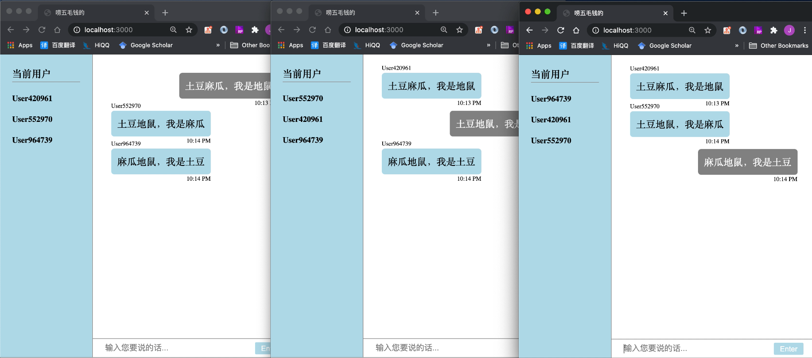

## 使用Socket.io + Express.js 实现的简单网页实时聊天室

### 实现过程

首先，启动服务器、监听端口和socket服务，并指定静态文件路径。

```js
const express = require("express");
const socket = require("socket.io");

// 设置
const PORT = 3000;
const app = express(); // 启动服务
const server = app.listen(PORT, function () { // 启动监听端口
  console.log(`启动服务器，监听端口：${PORT}`);
  console.log(`请打开浏览器，访问地址：localhost:${PORT}`);
});
const io = socket(server); // 启动socket

// 指定静态文件路径
app.use(express.static("src"));
```

然后创建`src`静态文件夹，以及其下的`css`、`html`和`js`文件，本文将省略对界面实现的介绍。

我们希望这个简单的demo具有以下功能：

1. 统计当前的在线用户
2. 用户之间的实时通信
3. 记录下每条信息的发送人及发送时间

因此客户端和服务器都需要可以触发三种行为：上线、离线和发送/接收聊天信息，这主要靠服务器和客户端共同`on/emit`同一事件实现。

在服务器端，需要设置3个对应的监听事件。

```js
/******** server.js ********/
// 监听WebSocket连接事件
io.on("connection", function (socket) { // 连接建立
  // 监听客户端发出的【新用户加入】
  socket.on("newUserJoinIn", () => {
    activeUsers.add(socket.userId);  // 将新用户的userId加入服务器端维护的在线用户表里
    io.emit("newUserJoinIn", [...activeUsers]); // 通知客户端有新成员加入聊天室，并将最新的用户信息发送给各个客户端
  });
	// 监听客户端发出的【断开连接】
  socket.on("disconnect", () => {
    activeUsers.delete(socket.userId); // 将此用户的id从在线用户表里删除
    io.emit("aUserDisconnect", socket.userId); // // 通知客户端有成员离开聊天室，并将最新的用户信息发送给各个客户端
  });
 // 监听客户端发出的【聊天信息】
  socket.on("chatMessage", function (data) {
    io.emit("chatMessage", data); // 服务器接收到信息后，广播给所有客户端
  });
});
```

在客户端，设置服务器所`emit`事件对应的监听，并`emit`服务器期待的监听。

```js
const newUserConnected = (user) => {
  userName = user || `User${Math.floor(Math.random() * 1000000)}`;
  socket.emit("newUserConnected", userName); // emit【新用户加入】
  addToUsersBox(userName);
};

// 用户登陆向服务器传出【有新用户加入】
newUserConnected();

// 监听服务器传来的【新用户加入】
socket.on("newUserConnected", function (data) {
  data.map((user) => addToUsersBox(user)); // 更新在线用户列表
});
// 监听服务器传来的【有用户离开】
socket.on("aUserDisconnected", function (userName) {
  document.querySelector(`.${userName}-userlist`).remove(); // 更新在线用户列表
});
// 监听服务器传来的【新消息】
socket.on("chatMessage", function (data) {
  addNewMessage({ user: data.nick, message: data.message }); // 更新聊天记录
});

// 用户输入信息后，点击发送
messageForm.addEventListener("submit", (e) => {
  e.preventDefault();
  if (!inputField.value) {
    return;
  }

  socket.emit("chatMessage", { // 用户向服务器发出【聊天信息】
    message: inputField.value,
    nick: userName,
  });

  inputField.value = "";
});
```

### 实现效果

在服务器、客户端均设置了事件触发及对应的监听后，即可完成双向通信，下面是最终的简单聊天室效果。



### 如何启动

> npm install 

> npm run build

